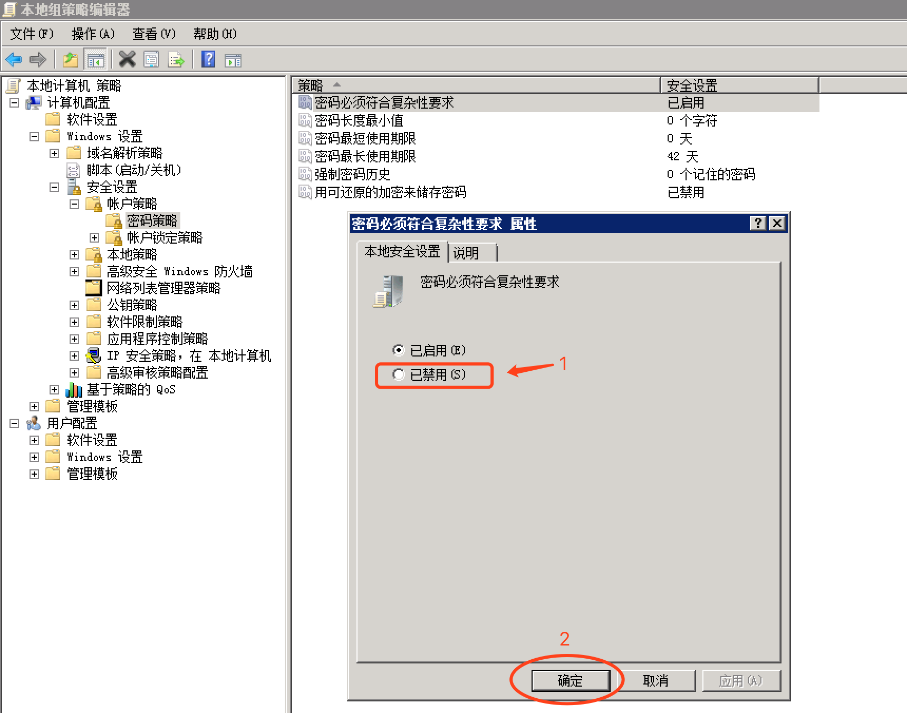
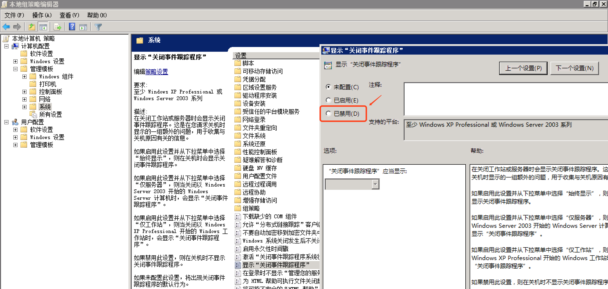

## Windows Server 安装

1. 配置IP
2. 开启远程桌面
3. 设置共享文件夹
4. 禁用密码复杂性要求：
   打开cmd -> 键入"gpedit.msc" -> "计算机配置" -> "Windows设置" -> "安全设置" -> "账户策略" -> "密码策略" -> "密码必须符合复杂性要求" -> "已禁用":
   
5. 禁用 显示"关闭事件跟踪程序"：
   打开cmd -> 键入"gpedit.msc" -> "计算机配置" -> "管理模板" -> "系统" -> 显示"关闭事件跟踪程序" -> "已禁用":
   
6. 修改用户密码：
   控制面板 -> 用户账户 -> 更改 Windows 密码 -> 更改密码
7. 激活操作系统：
   上传Windows系统激活软件 -> 激活 -> 重启
8. 安装其他软件：
   解压软件 7zip、编辑器 Notepad++ 等
